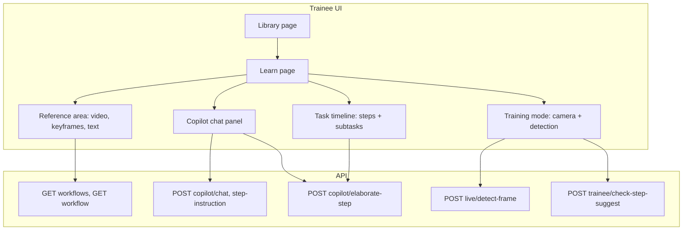

# Trainee-side implementation plan

## Choices (from your answers)

- **Stage complete**: Suggest then confirm — backend suggests "complete" when SAM3/pose match; user must confirm via voice ("next"/"done") or button/tap.
- **Subtasks**: Session-only — elaborated subtasks live in frontend/session state; no DB persistence.

---

## Architecture overview

---

## 1. Backend

### 1.1 Suggest completion endpoint

**New router** (e.g. `skillforge-api/routers/trainee.py` or under existing `routers/`):

- `**POST /api/trainee/check-step-suggest**`
  - Body: `workflow_id`, `step_id`, `frame_base64` (JPEG from trainee camera).
  - Logic:
    - Load step (get `sam3_prompt`, optional keyframe path).
    - Call existing [live_detect.py](skillforge-api/routers/live_detect.py) flow: decode frame → run SAM3 with step’s `sam3_prompt` (reuse [sam3_service.segment_concept](skillforge-api/services/sam3_service.py)) and MediaPipe hands (reuse [mediapipe_tracker.extract_hand_data_from_bytes](skillforge-api/services/mediapipe_tracker.py)).
    - Heuristic: e.g. “suggest = true” when SAM3 returns at least one segment above a confidence threshold and optionally “hand near object” (e.g. index tip or palm within some bbox distance of SAM3 segment). Thresholds can be env or constants.
  - Response: `{ "suggest_complete": boolean, "message": string }` (e.g. “Object detected and hand nearby” or “Object not clearly visible”).
  - No side effects; idempotent.

**Dependencies**: Reuse [live_detect.py](skillforge-api/routers/live_detect.py) and [sam3_service](skillforge-api/services/sam3_service.py), [mediapipe_tracker](skillforge-api/services/mediapipe_tracker.py). No new tables.

### 1.2 Elaborate-step endpoint

**New route** on copilot router (e.g. in [routers/copilot.py](skillforge-api/routers/copilot.py)):

- `**POST /api/copilot/elaborate-step**`
  - Body: `workflow_id`, `step_id`, optional `user_message`.
  - Load step (title, description, transcript) from DB; optionally pass keyframe or segmented image path to Claude for vision.
  - Call Claude with a fixed prompt: “Given this step, return a JSON array of 3–8 concrete subtasks, each with `title` and optional one-line `description`. Ordered. No preamble.”
  - Response: `{ "subtasks": [ { "title": "...", "description": "..." }, ... ] }`.
  - No DB write; stateless.

**Implementation**: New function in [services/claude_copilot.py](skillforge-api/services/claude_copilot.py) (e.g. `elaborate_step_to_subtasks`) and one new route that calls it.

### 1.3 Voice intent (optional but recommended)

- Extend [voice intent](skillforge/lib/voice-intent-matcher.ts) and backend `**POST /api/voice/intent**` (if it exists) to support an `**elaborate**` intent (e.g. “elaborate”, “break it down”, “more detail”).
- When intent is `elaborate`, frontend can call `POST /api/copilot/elaborate-step` and merge subtasks into the task timeline (see below).

---

## 2. Frontend — state and types

### 2.1 Trainee session state

- **Extend [store/player-store.ts**](skillforge/store/player-store.ts) (or add a small `trainee-session-store.ts`):
  - `subtasksByStep: Record<string, { title: string; description?: string }[]>` — key = step id.
  - `currentSubtaskIndexByStep: Record<string, number>` — per-step index when a step has subtasks.
  - Actions: `setSubtasksForStep(stepId, subtasks)`, `setCurrentSubtaskIndex(stepId, index)`, `clearSubtasksForStep(stepId)`.
  - On reset, clear these.
- **“Suggested complete” UI state** (can live in player store or local component state):
  - `suggestCompleteForStep: string | null` (step id when backend last returned `suggest_complete: true`).
  - `suggestCompleteMessage: string | null`.
  - So the UI can show a “Step looks complete — say ‘next’ or tap to continue” banner until the user confirms.

### 2.2 Types

- In [types/index.ts](skillforge/types/index.ts): add `Subtask { title: string; description?: string }` and ensure `PlayerState` (or trainee state) includes the new fields above if you put them in the store.

---

## 3. Frontend — Learn page and reference + chat

### 3.1 Reference area and chat (existing + small tweaks)

- The trainee route is [learn/[workflowId]/page.tsx](skillforge/app/(trainee)/learn/[workflowId]/page.tsx), which only renders [LearnView](skillforge/components/player/LearnView.tsx). All learn logic lives in **LearnView** — add training mode, suggest banner, and elaborate there (or in components it uses).
- **Reference area**: The UI uses **per-step video** (`currentStep?.video_path`) with [StepVideoOverlay](skillforge/components/player/StepVideoOverlay.tsx) and [StepTransition](skillforge/components/player/StepTransition.tsx) when the step video ends (no workflow-level VideoWithOverlay). Optionally add a keyframe strip using `step.frames` / `key_frame_path` and `segmented_frame_path` from [types](skillforge/types/index.ts).
- **Chat**: [CopilotPanel](skillforge/components/chat/CopilotPanel.tsx) and [useCopilotChat](skillforge/hooks/useCopilotChat.ts). Ensure the copilot receives current step (and optionally current subtask) so it can say “Step 2: Do X” or “Subtask 2.3: …”. No change to API contract; only pass current step id (and if you show subtasks, you can add a short “current subtask” line in the step context).

### 3.2 Task timeline (steps + subtasks)

- **Extend [StepProgressBar](skillforge/components/player/StepProgressBar.tsx) into a **TaskTimeline** (or keep name and extend):
  - Top level: workflow steps (as now).
  - For each step, if `subtasksByStep[step.id]` exists, render subtasks as nested items (indented list or collapsible under the step).
  - “Current” can be step index + optional subtask index (e.g. highlight step and sub-step).
  - Clicking a step (or subtask) sets current step and optional current subtask index; no new API, just state.

---

## 4. Frontend — training mode

### 4.1 Entry and layout

- On the learn page, add a **“Start training”** button (and optionally a **“Stop training”** to return to reference-only).
- When training is on:
  - Request camera (existing pattern from [record/session](skillforge/app/record/(expert)/session/page.tsx) or [live](skillforge/app/live/page.tsx)).
  - Layout option A: **Split view** — left = reference (video + keyframes/text), right = live camera feed. Option B: **Tab** — “Watch” vs “Practice” (Practice = full-screen camera + small reference strip). Recommend split for v1 so reference stays visible.

### 4.2 Camera and detection

- **Video source**: Use a `<video>` (or existing hook) fed by `getUserMedia` for the trainee’s camera.
- **Detection**: Use the same stack as [live detect](skillforge/app/live/page.tsx):
  - Either **HTTP**: capture frame from video (canvas), send as base64 to `POST /api/live/detect-frame` with `modes: ["sam3", "hands"]`, `text_prompt` = current step’s `sam3_prompt` (from [Step](skillforge/types/index.ts)).
  - Or **WebSocket** [useLiveDetect](skillforge/hooks/useLiveDetect.ts) if the live page uses it for camera (confirm whether WS accepts camera stream).
- **Interval**: Poll every 1–2 seconds (or configurable) so we don’t overload the API. Use [useSam3Detect](skillforge/hooks/useSam3Detect.ts) / [useMediaPipeDetect](skillforge/hooks/useMediaPipeDetect.ts) patterns: videoRef = camera video element, `textPrompt` = current step’s `sam3_prompt`, `enabled` = training mode on and current step has `sam3_prompt`.

### 4.3 Suggest-complete flow

- When detection runs, call `**POST /api/trainee/check-step-suggest**` with the same frame and `workflow_id`, `step_id` (current step).
- If response `suggest_complete === true`:
  - Set `suggestCompleteForStep` to current step id and `suggestCompleteMessage` to response message.
  - Show a **banner** (similar to existing “Step complete!” in LearnView when in training mode and suggestCompleteForStep equals current step id): “Looks like you’re done. Say ‘next’ or tap Continue.”
- User confirms by: **voice** (“next step” / “done”) via existing [useVoiceCommands](skillforge/hooks/useVoiceCommands.ts), or **button** “Continue”, or **gesture** (double-tap pinch) via [useDoubleTapDetection](skillforge/hooks/useDoubleTapDetection.ts). On confirm: advance step (and clear suggest state); if using subtasks, advance subtask or step as per timeline logic.

### 4.4 Gestures and voice (reuse)

- **Gestures**: When in training mode, hand data must come from the **camera** feed. If the app currently uses a separate AR WebSocket for hands, either (a) feed that WebSocket with the camera stream, or (b) use MediaPipe in-browser on the camera video ([useMediaPipeDetect](skillforge/hooks/useMediaPipeDetect.ts)) and pass the resulting `HandData` to [useDoubleTapDetection](skillforge/hooks/useDoubleTapDetection.ts). Right double-tap = next, left = previous.
- **Voice**: Keep [useVoiceCommands](skillforge/hooks/useVoiceCommands.ts) with `onNextStep` / `onPreviousStep`; ensure they advance step (and optional subtask) and clear suggest-complete state.

---

## 5. Frontend — elaborate and subtasks

### 5.1 Triggering elaborate

- **From chat**: User types “elaborate”, “break it down”, “more detail”, etc. Options: (1) Copilot detects intent in streamed response and returns a structured “elaborate” action + calls backend; (2) Frontend detects these phrases in user message and calls `POST /api/copilot/elaborate-step` directly, then injects a short assistant message “I’ve broken this step into N subtasks” and updates timeline. Option (2) is simpler for v1.
- **From voice**: If backend voice intent returns `elaborate`, frontend calls `elaborate-step` and updates `subtasksByStep` for current step.

### 5.2 After elaborate

- Call `POST /api/copilot/elaborate-step` with current `workflow_id` and `step_id`.
- On response: `setSubtasksForStep(stepId, response.subtasks)`.
- Task timeline re-renders and shows subtasks under that step. Optionally set “current” to first subtask (e.g. `setCurrentSubtaskIndex(stepId, 0)`).
- Copilot context: when rendering instructions, if current step has subtasks, include current subtask title/description in the step context so the copilot can reference it.

### 5.3 Advancing with subtasks

- When user confirms “next” (voice/button/gesture): if current step has subtasks and current subtask index is not last, advance subtask index only; else advance to next step and clear subtask index for the new step.

---

## 6. API client and wiring

- [lib/api-client.ts](skillforge/lib/api-client.ts):
  - Add `checkStepSuggest(workflowId, stepId, frameBase64)` → `Promise<{ suggest_complete: boolean; message: string }>`.
  - Add `elaborateStep(workflowId, stepId, userMessage?)` → `Promise<{ subtasks: { title: string; description?: string }[] }>`.
- Wire these into the learn page and (for elaborate) into chat or a small “Elaborate” button next to the step title.

---

## 7. Suggested implementation order

1. **Backend**: `POST /api/copilot/elaborate-step` and `elaborate_step_to_subtasks` in Claude service.
2. **Frontend state**: Subtask state in store; types for `Subtask`.
3. **Task timeline**: Extend StepProgressBar to show subtasks from store.
4. **Frontend**: Elaborate trigger (button or chat keyword) → call elaborate-step → update store and timeline.
5. **Backend**: `POST /api/trainee/check-step-suggest` and heuristic (SAM3 + optional hand proximity).
6. **Frontend**: “Start training” mode, camera capture, periodic check-step-suggest, suggest-complete banner, confirm via voice/button/gesture.
7. **Voice/gesture**: Ensure double-tap and voice use camera hands when in training mode; add `elaborate` intent if desired.
8. **Polish**: Keyframe strip for current step, optional “Elaborate” in copilot response handling.

---

## 8. Files to add or touch (summary)

| Area              | Files                                                                                                                                                                                                                                                                                                                                                                                |
| ----------------- | ------------------------------------------------------------------------------------------------------------------------------------------------------------------------------------------------------------------------------------------------------------------------------------------------------------------------------------------------------------------------------------ |
| API               | New [skillforge-api/routers/trainee.py](skillforge-api/routers/trainee.py) (or add to existing router); [skillforge-api/routers/copilot.py](skillforge-api/routers/copilot.py) (elaborate route); [skillforge-api/services/claude_copilot.py](skillforge-api/services/claude_copilot.py) (elaborate_step_to_subtasks); register trainee router in [main.py](skillforge-api/main.py). |
| Frontend state    | [skillforge/store/player-store.ts](skillforge/store/player-store.ts) or new `trainee-session-store.ts`; [skillforge/types/index.ts](skillforge/types/index.ts).                                                                                                                                                                                                                      |
| Timeline          | [skillforge/components/player/StepProgressBar.tsx](skillforge/components/player/StepProgressBar.tsx) (or new TaskTimeline).                                                                                                                                                                                                                                                          |
| Learn flow        | [skillforge/components/player/LearnView.tsx](skillforge/components/player/LearnView.tsx): add training mode, camera, suggest banner, elaborate trigger; [learn/[workflowId]/page.tsx](skillforge/app/(trainee)/learn/[workflowId]/page.tsx) only renders LearnView.                                                                                                                  |
| Detection / hooks | Reuse or adapt [useSam3Detect](skillforge/hooks/useSam3Detect.ts), [useMediaPipeDetect](skillforge/hooks/useMediaPipeDetect.ts) or [useLiveDetect](skillforge/hooks/useLiveDetect.ts) for camera videoRef; [useDoubleTapDetection](skillforge/hooks/useDoubleTapDetection.ts) fed by camera hands.                                                                                   |
| API client        | [skillforge/lib/api-client.ts](skillforge/lib/api-client.ts): `checkStepSuggest`, `elaborateStep`.                                                                                                                                                                                                                                                                                   |
| Voice             | [skillforge/lib/voice-intent-matcher.ts](skillforge/lib/voice-intent-matcher.ts) + backend voice intent (if present) for `elaborate`.                                                                                                                                                                                                                                                |

No new DB migrations; subtasks are session-only. Stage completion remains suggest-then-confirm, so no automatic step advancement without user action.

---

## 9. Verification against current codebase (updated)

These updates align the plan with the current pipeline and UI:

- **Learn flow**: Implementation target is [LearnView](skillforge/components/player/LearnView.tsx), not the learn page directly. The learn [page](skillforge/app/(trainee)/learn/[workflowId]/page.tsx) only renders `<LearnView workflowId={...} backHref="/library" backLabel="← Library" />`.
- **Reference area**: Uses **per-step video** (`stepVideoPath = currentStep?.video_path`) with a single `<video>` keyed by `currentStep!.id`, [StepVideoOverlay](skillforge/components/player/StepVideoOverlay.tsx) (click targets from `getClickTargetsForTime`), and [StepTransition](skillforge/components/player/StepTransition.tsx) when `isPausedAtStepEnd && currentStep` (auto-advance countdown 8s, `onContinue={handleAdvanceStep}`). There is no `VideoWithOverlay` on the learn path; `VideoWithOverlay`/`OverlayCanvas` exist but are not used in LearnView.
- **Suggest-complete banner**: In training mode, show a separate “suggest complete” banner when `suggestCompleteForStep === currentStep?.id` (e.g. “Looks like you’re done. Say ‘next’ or tap Continue.”). This can sit alongside or replace the StepTransition when in training mode (e.g. do not auto-advance on timer when suggest-complete is shown; user confirms via voice/button/gesture).
- **Player store**: [player-store.ts](skillforge/store/player-store.ts) already has `stepProgress` and `setStepProgress`; add `subtasksByStep`, `currentSubtaskIndexByStep`, `suggestCompleteForStep`, `suggestCompleteMessage`, and their setters/clear in `reset`.
- **StepProgressBar**: [StepProgressBar.tsx](skillforge/components/player/StepProgressBar.tsx) already uses `currentStepIndex`, `stepProgress`, `isPlaying` and draws a fill-percent per step; extend it to read `subtasksByStep` (and optional `currentSubtaskIndexByStep`) from the store and render nested subtasks under each step.
- **Voice intent**: Backend is [routers/voice.py](skillforge-api/routers/voice.py): `POST /api/voice/intent` with [VoiceIntentRequest](skillforge-api/models/schemas.py). Extend `INTENT_PROMPT` and the regex to support **elaborate** (e.g. “elaborate”, “break it down”, “more detail”) and return `"elaborate"`; frontend [classifyVoiceIntent](skillforge/lib/api-client.ts) and [voice-intent-matcher](skillforge/lib/voice-intent-matcher.ts) should handle the new intent.
- **Live detection**: [routers/live_detect.py](skillforge-api/routers/live_detect.py) exposes `POST /api/live/detect-frame` (body: `frame_base64`, `modes`, `text_prompt`, `confidence_threshold`); uses [mediapipe_tracker.extract_hand_data_from_bytes](skillforge-api/services/mediapipe_tracker.py) and [sam3_service.segment_concept](skillforge-api/services/sam3_service.py). The trainee suggest endpoint should call the same helpers (decode frame, run SAM3 with step’s `sam3_prompt`, run MediaPipe), then apply the suggest heuristic.
- **main.py**: [main.py](skillforge-api/main.py) includes `workflows_router`, `recording_router`, `editor_router`, `pipeline_router`, `copilot_router`, `voice_router`, `asr_router`, `live_detect_router`, `guided_recording_router`. Add and include a new **trainee_router** for `POST /api/trainee/check-step-suggest`.

