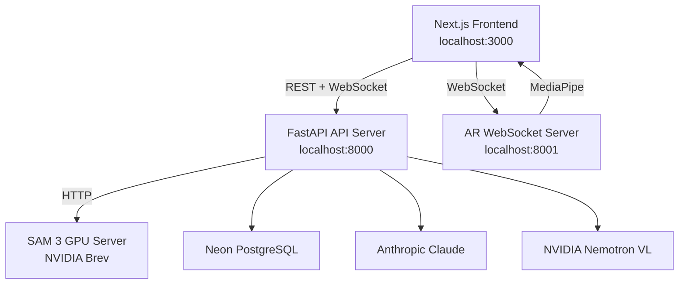

# SkillForge

An AI-powered knowledge transfer platform that bridges the gap between expert practitioners and trainees — capturing expert workflows through video recording and turning them into structured, interactive learning experiences.

---

## Overview

SkillForge lets experts record what they know, and lets AI turn those recordings into structured, interactive learning experiences for trainees.

**Expert Recording** — Experts record themselves performing tasks via webcam with voice narration. An AI pipeline (NVIDIA Nemotron VL + Claude) extracts steps, identifies key moments, and generates annotations. Experts can then refine steps in a visual editor.

**Trainee Learning** — Trainees browse a library of published workflows and replay recordings with AI-drawn overlays and a built-in Claude copilot chat for real-time guidance.

**Live Camera Detection** — A standalone mode with no workflow required. Point a camera, toggle detectors (hand tracking, SAM 3 concept segmentation), and see real-time overlays on the camera feed.

---

## Architecture



| Component | Description | Required |
|---|---|---|
| **Frontend** | Next.js 16 / React 19 web app | Yes |
| **API Server** | FastAPI backend — pipelines, detection, storage, copilot | Yes |
| **AR WebSocket Server** | Dedicated FastAPI process for real-time hand tracking over WebSocket | Optional |
| **SAM 3 GPU Server** | Remote inference server for concept segmentation, deployed on NVIDIA Brev | Optional |

---

## Tech Stack

- **Frontend** — Next.js 16, React 19, TypeScript, Tailwind CSS 4, Zustand, Fabric.js, Framer Motion
- **Backend** — Python FastAPI, uvicorn, Neon PostgreSQL (asyncpg), SQLite fallback
- **AI / ML** — Claude Sonnet (Anthropic), Nemotron VL (NVIDIA NIM), MediaPipe Hands, Grounding DINO 1.5, SAM 2/3
- **Real-time** — WebSockets for pipeline progress and AR hand tracking

---

## Project Structure

```
skillforge/
├── skillforge/                  # Next.js frontend
│   ├── app/                     # App Router pages
│   │   ├── (expert)/            # Expert routes: /workflows, /editor/[id]
│   │   ├── (trainee)/           # Trainee routes: /library, /learn/[id]
│   │   ├── record/              # Recording flow: /record, /record/setup, /record/session
│   │   └── live/                # Live camera detection: /live
│   ├── components/              # Modular UI components
│   ├── hooks/                   # React hooks (camera, detection, sessions)
│   ├── lib/                     # API clients, constants, utilities
│   ├── store/                   # Zustand stores
│   └── backend/                 # AR WebSocket server (separate process)
├── skillforge-api/              # FastAPI API server
│   ├── models/                  # Database layer (asyncpg + aiosqlite)
│   ├── routers/                 # API route handlers
│   ├── services/                # ML services, pipelines, storage
│   └── websockets/              # WebSocket broadcast management
├── deploy/                      # GPU deployment scripts
│   └── sam3_server.py           # SAM 3 inference server for NVIDIA Brev
└── docs/                        # Setup guides
```

---

## Quick Start

### Prerequisites

- Python 3.10+
- Node.js 18+
- `pip` and `pnpm` (or `npm`)

### 1. Start the API server

```bash
cd skillforge-api
python3 -m venv venv
source venv/bin/activate
pip install -r requirements.txt
cp .env.example .env          # edit with your API keys
uvicorn main:app --reload --port 8000 --ws wsproto
```

Full details: [API Server Setup](docs/api-server-setup.md)

### 2. Start the frontend

```bash
cd skillforge
pnpm install
pnpm dev
```

Full details: [Frontend Setup](docs/frontend-setup.md)

### 3. Open the app

Navigate to [http://localhost:3000](http://localhost:3000).

**Phone as camera:** Run ngrok to expose the app over HTTPS, then open the app in your browser via the ngrok URL:

```bash
ngrok http 127.0.0.1:3000
```

Connect at `https://phytocidal-unsquabbling-joshua.ngrok-free.dev/` (or whatever URL ngrok prints). See [Phone as camera (ngrok)](docs/phone-camera-ngrok.md) for full setup.

### Optional components

- **AR WebSocket Server** — real-time hand tracking over WebSocket. See [AR WebSocket Server](docs/ar-websocket-server.md).
- **SAM 3 GPU Server** — concept segmentation on NVIDIA Brev. See [SAM 3 GPU Deployment](docs/sam3-gpu-deployment.md).

---

## Workflows

### Expert Recording Flow

1. Expert navigates to `/record` and selects a recording mode.
2. Expert enters a title and description, then records via webcam with voice narration at `/record/session`.
3. Steps are captured using "Next Step" (button, voice command, or double-tap gesture).
4. On finish, the AI pipeline runs: frame extraction, Nemotron VL analysis, MediaPipe hand tracking, Claude step decomposition.
5. Expert lands in the workflow editor at `/editor/[id]` to refine steps, add annotations, and publish.

### Trainee Learning Flow

1. Trainee browses the library at `/library` and opens a workflow at `/learn/[id]`.
2. Trainee watches the video with AI-drawn overlays and uses the built-in Claude copilot chat for real-time guidance.

### Live Camera Detection

1. Navigate to `/live`.
2. Enable the camera.
3. Toggle individual detectors: Hand Tracking (MediaPipe), SAM 3 Concept Segmentation, or Custom Prompt (Grounding DINO with Claude fallback).
4. Real-time overlays are drawn directly on the camera feed.

---

## Fallback Behavior

SkillForge is designed to be fully functional with only an `ANTHROPIC_API_KEY`, making it straightforward to run locally without any cloud infrastructure.

| Component | Primary | Fallback |
|---|---|---|
| Frame analysis | NVIDIA Nemotron VL | Claude Vision |
| Object detection | Grounding DINO 1.5 | Claude Vision |
| Segmentation | SAM 3 / SAM 2 | Skipped |
| Database | Neon PostgreSQL | Local SQLite |
| File storage | Local `uploads/` | — |

---

## Documentation

| Guide | Description |
|---|---|
| [API Server Setup](docs/api-server-setup.md) | Running the FastAPI backend, database, storage, endpoints, and pipeline architecture |
| [Frontend Setup](docs/frontend-setup.md) | Running the Next.js app, routes, and frontend-backend connectivity |
| [AR WebSocket Server](docs/ar-websocket-server.md) | Running the dedicated hand tracking WebSocket server |
| [SAM 3 GPU Deployment](docs/sam3-gpu-deployment.md) | Deploying the SAM 3 inference server on NVIDIA Brev |
| [Environment Variables](docs/environment-variables.md) | Consolidated reference for every env var across all services |

---

## License

This project is for internal and educational use. See individual service documentation for third-party licensing terms (Meta SAM 2/3, Grounding DINO, NVIDIA NIM, Anthropic Claude).
