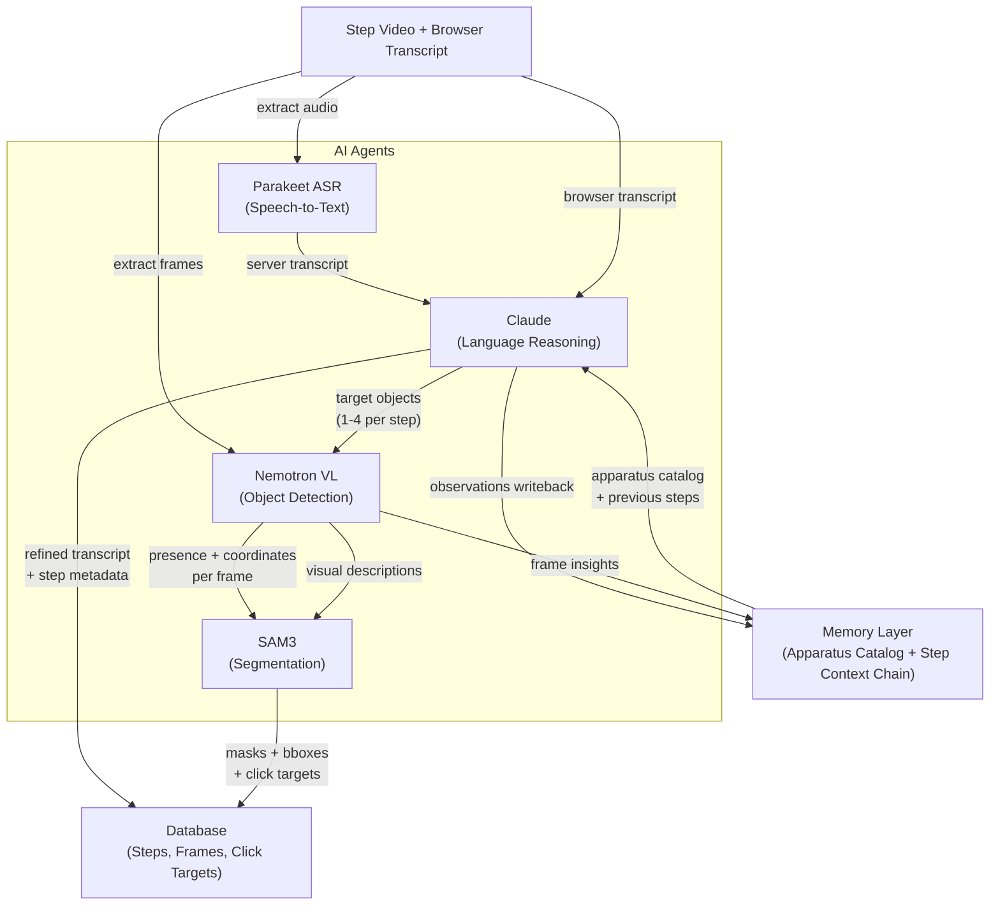
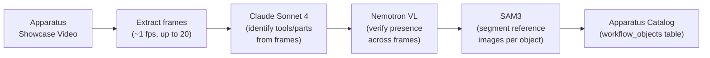
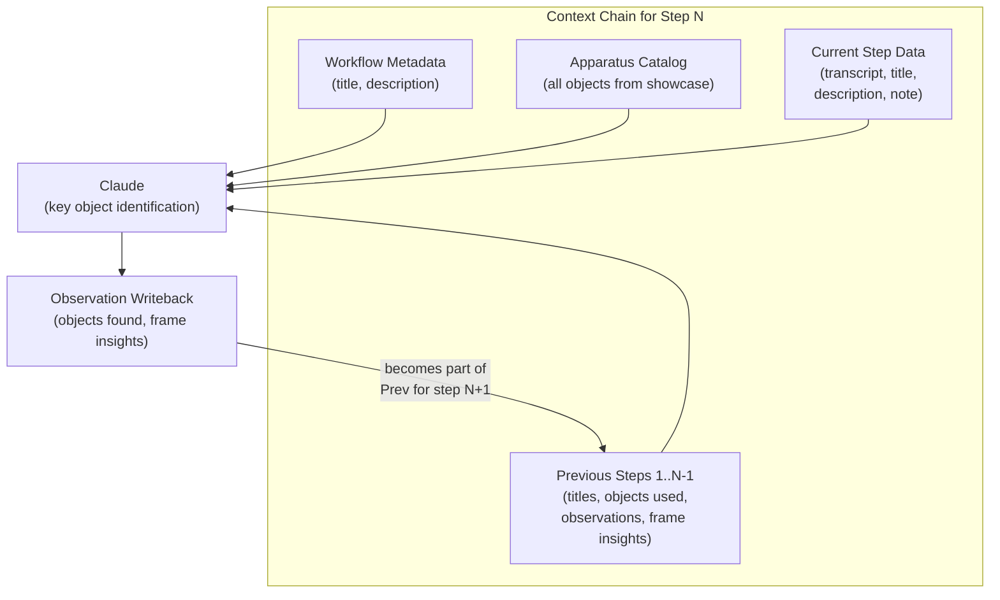

# Multi-Agent System Architecture

SkillForge uses four specialized AI agents -- each handling a distinct modality -- to convert raw expert recordings into structured, interactive tutorials with pixel-level object segmentation and spatial click targets.

| Agent | Modality | Model | Deployment |
|-------|----------|-------|------------|
| **Claude** | Language reasoning | Haiku 4.5 / Sonnet 4 | Anthropic API |
| **Parakeet** | Speech-to-text | NVIDIA CTC 1.1B | Self-hosted (independent) |
| **Nemotron VL** | Visual detection | NVIDIA Nano 12B v2 VL | Self-hosted (vLLM) |
| **SAM3** | Image segmentation | Segment Anything 3 | Self-hosted |

## High-Level Agent Collaboration



## The Four Agents

### Claude (Anthropic) -- Language Reasoning Brain

Claude serves as the orchestrator and decision-maker across the pipeline. It never sees raw pixels directly during step processing; instead it reasons over transcripts, metadata, and the accumulated memory context to drive the other agents.

**Transcript Refinement** (Haiku 4.5) -- Receives both the browser-side transcript (Chrome Web Speech API) and the server-side Parakeet transcript. Cross-references them against workflow context (title, apparatus catalog, previous steps) to fix ASR errors, remove filler words, and normalize domain-specific terms. Uses the cheaper Haiku model since this is a high-volume, lower-complexity task.

**Step Metadata Generation** (Sonnet 4) -- From the refined transcript and expert notes, produces a concise title (max 8 words), an imperative description for the trainee, and a narrative summary. Output is structured JSON.

**Key Object Identification** (Sonnet 4) -- The most critical reasoning step. Claude analyzes the current step's transcript, description, and the full memory context (apparatus catalog + all previous steps) to decide which 1-4 physical objects the trainee should focus on. For each object it returns a label, role (`primary` / `context` / `warning`), visual cues, and a SAM3-optimized segmentation prompt. This output drives both Nemotron scanning and SAM3 segmentation.

**Apparatus Identification** (Sonnet 4) -- During the apparatus showcase phase, Claude receives sampled frames from the showcase video and identifies all distinct tools, parts, and components the trainer is presenting. Returns structured object descriptors with frame groupings.

### Parakeet (NVIDIA CTC 1.1B) -- Speech-to-Text

Parakeet runs as an independent, self-hosted ASR service. It does not depend on any external web search API or cloud service -- it processes audio locally on the GPU.

**How it works:** Audio is extracted from each step's video file using PyAV (converted to 16 kHz mono WAV), then sent to the Parakeet server via HTTP POST. The server returns a raw transcript string.

**Why two transcripts?** The browser captures speech in real-time via Chrome's Web Speech API (low latency but error-prone), while Parakeet processes the full audio track offline (higher accuracy). Claude reconciles both to produce the best possible transcript.

| Config | Value |
|--------|-------|
| Endpoint | `ASR_URL` (e.g. `http://localhost:8091/transcribe`) |
| Model | `nvidia/parakeet-ctc-1.1b-asr` |
| Input | 16 kHz mono PCM WAV |
| Output | Plain text transcript |

### Nemotron VL (NVIDIA Nano 12B v2) -- Visual Object Detection

Nemotron is a vision-language model that answers the question: "Is this object present in this frame?" For each frame where the answer is yes, it also returns the approximate center coordinates (normalized 0-1) and a short visual description.

**Detection flow:** For each target object identified by Claude, Nemotron scans every extracted frame. All objects are scanned in parallel using a shared concurrency semaphore (6 concurrent requests) to saturate the GPU without overwhelming it. The prompt includes step context (title, description, expert narration) to improve detection accuracy.

**Output per frame:**
```json
{
  "present": true,
  "description": "Red insulated wire with stripped copper ends held near the VIN pin",
  "center_x": 0.45,
  "center_y": 0.62
}
```

**Nemotron-to-SAM3 enrichment:** When Nemotron detects an object, its visual description is cleaned (preamble stripped, reduced to a concise noun phrase) and used as the SAM3 text prompt instead of Claude's generic `sam3_prompt`. This frame-specific enrichment significantly improves segmentation accuracy.

### SAM3 (Segment Anything Model 3) -- Pixel-Level Segmentation

SAM3 produces precise pixel masks for objects in video frames. It supports three prompt modes:

- **Text prompt** -- a descriptive phrase is matched via CLIP text encoder (primary pipeline mode)
- **Point prompt** -- a click coordinate generates a bounding box for segmentation (editor mode)
- **Box prompt** -- explicit bounding box coordinates (editor mode)

**Multi-concept segmentation:** When multiple objects are present in a single frame, SAM3 is called once per object in parallel, and results are merged with per-object labels and roles. Each segment carries role-based color coding for the overlay visualization (primary = green, context = blue, warning = red).

**Output per segment:**
```json
{
  "mask_base64": "<base64 PNG>",
  "bbox": [0.12, 0.30, 0.45, 0.78],
  "score": 0.92,
  "label": "red wire",
  "role": "primary"
}
```

## Per-Step Pipeline

Each step flows through six stages. Stages 1-5 run immediately as the step is uploaded; stage 6 is deferred until all steps are complete.

```mermaid
flowchart TD
    Upload["Step Video + Browser Transcript + Note"]

    subgraph stage1 [Stage 1: Frame Extraction]
        Extract["Extract key frames\n(~1 fps + scene-change detection)"]
    end

    subgraph stage2 [Stage 2: Transcript Refinement]
        Audio["Extract audio via PyAV"]
        ASR["Parakeet ASR\n(16kHz mono WAV)"]
        Refine["Claude Haiku 4.5\n(reconcile browser + server transcripts\nwith workflow context)"]
    end

    subgraph stage3 [Stage 3: Step Metadata]
        Meta["Claude Sonnet 4\n(generate title, description, summary)"]
    end

    subgraph stage4 [Stage 4: Key Object Analysis]
        Context["Memory Layer\n(build context chain)"]
        Identify["Claude Sonnet 4\n(identify 1-4 target objects)"]
        Scan["Nemotron VL\n(scan all frames x all objects)"]
    end

    subgraph stage5 [Stage 5: DB Persistence]
        Persist["Store step, frames,\ndetection results"]
        Writeback["Write observations\nback to Memory Layer"]
    end

    subgraph stage6 [Stage 6: Deferred Segmentation]
        Rescan["Nemotron VL\n(re-scan ALL frames, expanded budget)"]
        Segment["SAM3\n(segment positive frames,\nmulti-concept parallel)"]
        Overlay["Generate overlay images\n+ store click targets"]
    end

    Upload --> Extract
    Extract --> Audio
    Audio --> ASR
    ASR --> Refine
    Refine --> Meta
    Meta --> Context
    Context --> Identify
    Identify --> Scan
    Scan --> Persist
    Persist --> Writeback
    Writeback -.->|"after ALL steps complete"| Rescan
    Rescan --> Segment
    Segment --> Overlay
```



SAM3 segmentation is intentionally deferred to run after all steps are processed. This lets it operate on the full frame set (not the subsampled detection budget) and complete during the loading screen before the workflow is marked "ready."

## Apparatus Showcase Pipeline

Before step-by-step recording begins, the expert can record a showcase video panning over all tools and components. This feeds the apparatus catalog that Claude references throughout.



1. **Claude** receives up to 20 sampled frames and identifies all distinct tools, parts, and components with frame groupings. Irrelevant objects (personal items, body parts, furniture) are filtered out.
2. **Nemotron** verifies each object's presence across a subsampled set of frames (up to 10), confirming multi-angle visibility and updating reference frames.
3. **SAM3** segments each confirmed object on its best frames (up to 4 per object), generating reference overlay images stored alongside the catalog entry.

The resulting catalog is persisted in the `workflow_objects` table and injected into Claude's context for every subsequent step.

## Memory Layer

The memory layer provides cross-step context continuity so each agent's decisions improve as the workflow progresses.



**Context chain:** For step N, Claude receives the workflow metadata, the full apparatus catalog, summaries of all previous steps (including which objects were detected and what Nemotron observed), and the current step's data.

**Observation writeback:** After Claude/Nemotron/SAM3 finish processing a step, the results (objects identified, frame-level observations) are written back to the memory layer. This becomes part of the "previous steps" context for step N+1.

**Invalidation:** When a step is re-recorded, all context documents from that step onward are deleted and rebuilt during reprocessing.

## Pipeline Orchestration

The `WorkflowPipelineManager` provides two processing modes:

**Incremental mode** (primary): Steps are processed one at a time as the expert finishes each step during recording. A background worker consumes from an async queue with ordering guarantees:
- Apparatus analysis completes before any step starts
- Step N-1 completes before step N starts (memory context dependency)
- The "complete" event fires only after all steps are done and deferred SAM3 finishes

**Batch mode** (legacy fallback): All step videos are uploaded at once after recording and processed sequentially through the same `process_single_step` function.

## Configuration

| Variable | Purpose | Example |
|----------|---------|---------|
| `ANTHROPIC_API_KEY` | Claude API access | `sk-ant-...` |
| `ASR_URL` | Parakeet ASR endpoint | `http://localhost:8091/transcribe` |
| `NEMOTRON_URL` | Nemotron VL server | `http://localhost:8080` |
| `SAM3_URL` | SAM3 segmentation server | `http://localhost:8090` |
| `DATABASE_URL` | Neon PostgreSQL | `postgresql://...` |

## Source Files

| File | Role |
|------|------|
| `services/hardware_pipeline.py` | Main orchestrator, `WorkflowPipelineManager`, deferred SAM3 |
| `services/key_object_pipeline.py` | 3-agent chain: Claude identify -> Nemotron scan -> SAM3 segment |
| `services/apparatus_pipeline.py` | Apparatus showcase: Claude -> Nemotron -> SAM3 |
| `services/asr_service.py` | Parakeet ASR client, audio extraction |
| `services/nemotron_client.py` | Nemotron VL client, parallel detection |
| `services/sam3_service.py` | SAM3 segmentation (text, point, box, multi-concept) |
| `services/memory_layer.py` | Persistent context chain, apparatus catalog |
